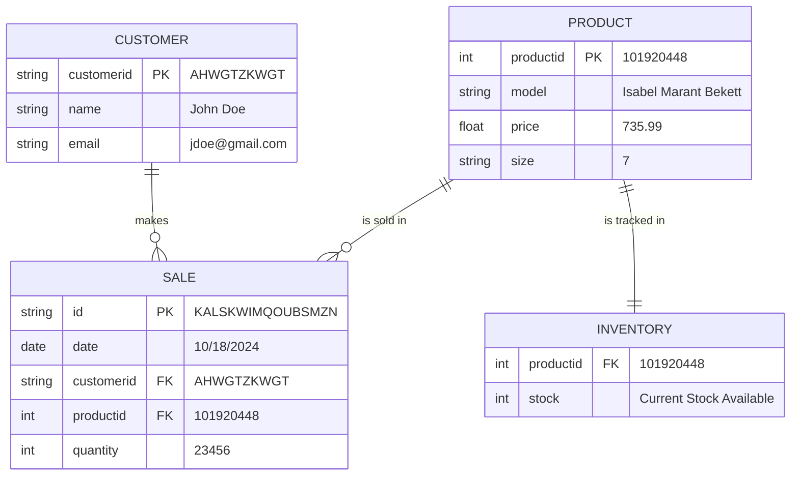

## Isabel Marant ERD

## Documentation
The Isabel Marant sales system works in a straightforward way using four main parts: PRODUCT, CUSTOMER, SALE, and INVENTORY. When a customer buys something, a sale record is created. This record includes details like which product was purchased, how much was bought, and when the sale happened. Each product has a unique ID and is tracked in inventory to keep an eye on stock levels. As sales happen, the inventory is updated to reflect what’s available. 