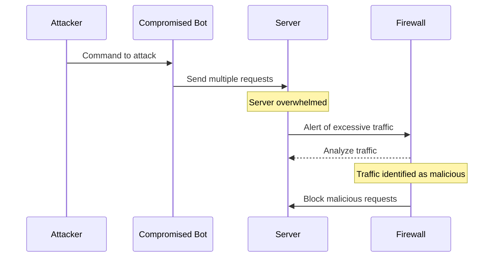

## Documentation
The four key components in this sequence diagram are the Attacker who initiates the attack, the Compromised Bot which represents the bots sending requests, the Server which is the target and becomes overwhelmed, and the Firewall which acts as the defense mechanism responding to the attack. First, the Attacker commands the Bot to start the attack. Then, the Bot sends multiple requests to the Server. The Server becomes overwhelmed with the excessive requests. The Server alerts the Firewall about the excessive traffic it is receiving. The Firewall analyzes the traffic and identifies it as malicious. The Firewall then blocks the malicious requests to protect the Server.