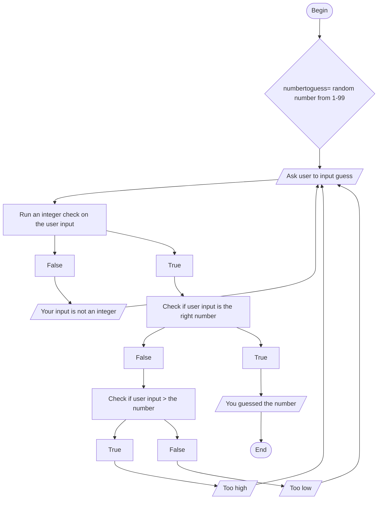

## Guessing Game

## Documentiation
For this flowchart, the computer begins by generating a random numbertoguess variable ranging from 1-99. It will then ask the user to input a guess as to what the randomly generated number can be. From there, it will run an integer check to ensure that the user inputs an integer and not a letter or decimal. If the check is false, the computer will output "Your input is not an integer" and ask the user to input another guess. If the integer check is True, the computer will then check if the user input is the correct number. If it is True, the computer will output "You guessed the number" and the program will end. If it is False, the computer will then check if the guessed number is higher than numbertoguess. If it is False, the computer will output "Too high" and if it is True, the computer will output "Too low". Both outputs will then loop back to asking the user to input another guess. 